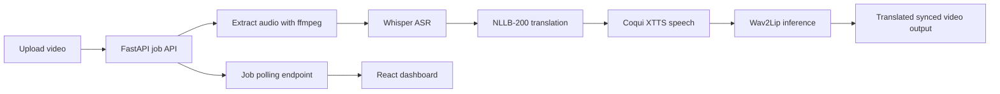

# Multilingual Deepfake Translator

Real-time style multilingual video translation pipeline with lip sync:
- ASR: Whisper
- Translation: Fairseq/HuggingFace NLLB-200
- TTS: Coqui XTTS v2
- Lip Sync: Wav2Lip
- Product surface: FastAPI backend + React frontend

This repo is built for recruiter demos and portfolio use. It supports **real mode** (actual model inference) and **mock mode** (fast smoke tests).

## Project structure

```text
backend/         FastAPI API + async job pipeline
frontend/        React + Vite web UI
scripts/         setup/bootstrap helpers
.github/         CI workflow
```

## Architecture



## Quickstart (real mode)

1. Bootstrap base dependencies:

```bash
./scripts/bootstrap.sh
```

2. Install ML dependencies:

```bash
source .venv/bin/activate
pip install -r backend/requirements-ml.txt
```

3. Ensure ffmpeg is installed:

```bash
ffmpeg -version
```

4. Install Wav2Lip repo/checkpoint:

```bash
./scripts/setup_wav2lip.sh
```

5. Start backend:

```bash
source .venv/bin/activate
cd backend
uvicorn app.main:app --reload --host 0.0.0.0 --port 8000
```

6. Start frontend (new terminal):

```bash
cd frontend
cp .env.example .env
npm run dev
```

7. Open `http://localhost:5173` and upload a short video.

If the page does not load:
- confirm frontend terminal prints `VITE ... ready` and `http://localhost:5173/`
- run `lsof -iTCP:5173 -sTCP:LISTEN -nP` and verify a Node process is listening
- restart terminal and run `source ~/.zshrc` once

## Mode switching

- `.env` defaults to `PIPELINE_MODE=real`.
- For smoke tests, set `PIPELINE_MODE=mock` and restart backend.
- Set `USE_GPU=true` only on a CUDA-capable machine.

Notes for real mode:
- First run will download Whisper/NLLB/Coqui weights.
- Real-time latency depends heavily on GPU and input resolution.
- For near real-time, keep input around `480p`, use CUDA, and batch frames.

## API endpoints

- `GET /api/v1/health`
- `GET /api/v1/languages`
- `POST /api/v1/jobs` (multipart: `video`, `source_language`, `target_language`, optional `speaker_wav`)
- `GET /api/v1/jobs/{job_id}`
- `GET /api/v1/jobs/{job_id}/download`

## Docker

```bash
docker compose up --build
```

Frontend: `http://localhost:5173`
Backend: `http://localhost:8000/api/v1/health`

This Docker image includes ML dependencies by default and runs real mode when `.env` has `PIPELINE_MODE=real`.

## GitHub publishing

1. Create a new GitHub repo.
2. Run:

```bash
git init
git checkout -b codex/multilingual-deepfake-translator
git add .
git commit -m "Initial full-stack multilingual deepfake translator"
git remote add origin <YOUR_GITHUB_REPO_URL>
git push -u origin codex/multilingual-deepfake-translator
```

3. Open PR to `main` or set this branch as default.

## Deployment (frontend + backend)

### Option A: Render Blueprint (single repo, easiest)

1. Push this repo to GitHub.
2. In Render, create a new Blueprint and point to this repo.
3. Render will read `render.yaml` and create:
- `mdt-backend` Docker web service
- `mdt-frontend` static web service
4. After first deploy:
- set frontend env `VITE_API_URL` to `https://<your-backend-service>.onrender.com/api/v1`
- set backend env `CORS_ORIGINS_CSV` to your frontend URL `https://<your-frontend-service>.onrender.com`
5. On backend disk, upload:
- Wav2Lip repo at `/app/models/Wav2Lip`
- checkpoint at `/app/models/wav2lip/wav2lip_gan.pth`

### Option B: Vercel + GPU backend

1. Deploy frontend on Vercel from `frontend/`.
2. Deploy backend on a GPU-capable provider (RunPod/Modal/self-hosted VM) using `backend/Dockerfile`.
3. Set `VITE_API_URL` to backend URL and `CORS_ORIGINS_CSV` to frontend URL.

Important:
- Real Wav2Lip + TTS inference is resource-heavy; free tiers are usually too weak for near real-time.

## Portfolio positioning

Use this concise pitch in your resume/project card:

> Built a production-style multilingual deepfake translator with Whisper ASR, NLLB-200 translation, Coqui XTTS voice synthesis, and Wav2Lip lip-sync rendering, exposed through a FastAPI + React product with asynchronous job orchestration and deployable Docker infrastructure.

## Ethical usage

Only process media with consent. Consider adding watermarking, user verification, and abuse prevention before public release.

## Technical references

- Whisper: https://github.com/openai/whisper
- NLLB-200 model card: https://huggingface.co/facebook/nllb-200-distilled-600M
- Coqui TTS docs: https://docs.coqui.ai/
- Wav2Lip: https://github.com/Rudrabha/Wav2Lip
