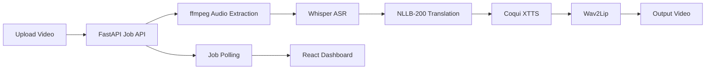

# Multilingual Deepfake Translator

AI video dubbing pipeline with multilingual translation and lip synchronization.

[](https://github.com/priyankaacodess/multilingual-deepfake-translator/actions/workflows/ci.yml)
[](https://www.python.org/)
[](https://react.dev/)

[](https://render.com/deploy?repo=https://github.com/priyankaacodess/multilingual-deepfake-translator)

## Why this project

This project turns a talking-head video into a translated video in another language:
- Transcribe speech with Whisper
- Translate with NLLB-200
- Generate target speech with Coqui XTTS
- Sync lip movements with Wav2Lip
- Serve as a testable product via FastAPI + React

## Demo

- Local UI: `http://localhost:5173`
- API Health: `http://localhost:8000/api/v1/health`
- Add your demo GIF here after first successful run: `assets/demo.gif`

## Architecture



## Tech stack

- Backend: FastAPI, Pydantic, async job executor
- Frontend: React + Vite + TypeScript
- ASR: OpenAI Whisper
- Translation: Fairseq/HuggingFace NLLB-200
- TTS: Coqui XTTS v2
- Lip sync: Wav2Lip
- Infra: Docker, GitHub Actions, Render blueprint

## Local setup (real mode)

1. Bootstrap base dependencies:

```bash
./scripts/bootstrap.sh
```

2. Install ML dependencies:

```bash
source .venv/bin/activate
pip install -r backend/requirements-ml.txt
```

3. Install Wav2Lip assets:

```bash
./scripts/setup_wav2lip.sh
```

4. Start backend:

```bash
cd backend
source ../.venv/bin/activate
uvicorn app.main:app --reload --host 0.0.0.0 --port 8000
```

5. Start frontend (new terminal):

```bash
cd frontend
source ~/.zshrc
cp .env.example .env
npm run dev
```

6. Open `http://localhost:5173`

## Run in mock mode (fast smoke test)

Edit `.env`:

```env
PIPELINE_MODE=mock
```

Restart backend after changing mode.

## One-click deployment

Use the Deploy to Render button above, or:

1. Push repo to GitHub.
2. In Render, create a Blueprint from this repo (`render.yaml`).
3. Set environment variables after first deploy:
- Frontend: `VITE_API_URL=https://<your-backend>.onrender.com/api/v1`
- Backend: `CORS_ORIGINS_CSV=https://<your-frontend>.onrender.com`
4. Upload Wav2Lip artifacts on backend disk:
- `/app/models/Wav2Lip`
- `/app/models/wav2lip/wav2lip_gan.pth`

## Create a demo GIF for GitHub

After generating an output video, run:

```bash
./scripts/make_demo_gif.sh storage/outputs/<job-id>.mp4 assets/demo.gif 960
```

## Repo structure

```text
backend/         FastAPI app + pipeline
frontend/        React web app
scripts/         bootstrap + setup helpers
.github/         CI workflow
render.yaml      one-click Render blueprint
```

## Resume-ready one-liner

Built a production-style multilingual video dubbing system using Whisper, NLLB-200, Coqui XTTS, and Wav2Lip with a deployable FastAPI + React interface for end-user testing.

## Troubleshooting

- `npm: command not found`

```bash
echo 'export PATH="/opt/homebrew/opt/node@22/bin:$PATH"' >> ~/.zshrc
source ~/.zshrc
```

- `ERR_CONNECTION_REFUSED` on `localhost:5173`
  - Frontend server is not running. Start `npm run dev` in `frontend/`.

- CORS errors
  - Set backend env `CORS_ORIGINS_CSV` to your frontend URL.

## Ethical use

Only process media with consent. Add watermarking, authentication, abuse monitoring, and content moderation before public release.

## References

- Whisper: https://github.com/openai/whisper
- NLLB-200: https://huggingface.co/facebook/nllb-200-distilled-600M
- Coqui TTS: https://docs.coqui.ai/
- Wav2Lip: https://github.com/Rudrabha/Wav2Lip
